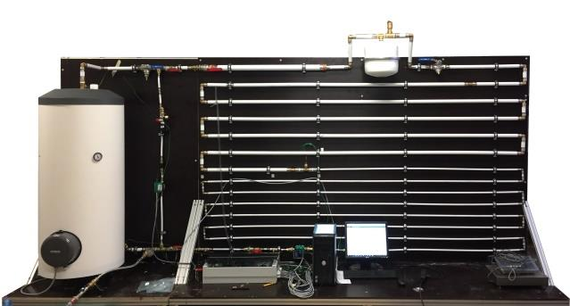

Een proefopstelling werd ontworpen en gebouwd voor onderzoek en ontwikkeling. Deze proefopstelling stelt een residentieel warmwatersysteem voor. Het distributiesysteem is een circulatieleiding. De proefopstelling is zo ontworpen dat de productie-eenheid gemakkelijk vervangen kan worden. Momenteel worden er testen uitgevoerd met een elektrische boiler en warmtepompboiler. In de toekomst voorzien we ook een warmtepompboiler verbonden met zonnecollectoren. Dit laat toe om verschillende systeemconfiguraties met deze componenten te testen.

De proefopstelling bevat Legionella pneumophila serogroep 1, hiermee kunnen we de effectiviteit van anti-Legionella producten testen en optimaliseren alvorens ze op de markt te brengen.

